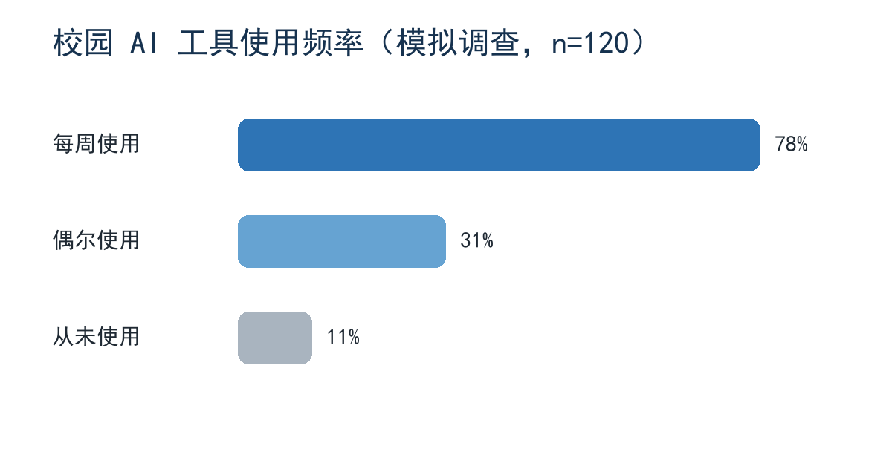

# 校园 AI 学习助手设计与评估

学生登记：王芳（20269008）

## 1. 问题背景与目标

校园新生经常找不到课程资料和学习支持渠道。本项目设计一个生成式 AI 学习助手，帮助学生检索课程 FAQ、整理复习提纲，并在回答末尾提示核对原始资料。目标是在不替代教师判断的前提下缩短资料定位时间。

## 2. 成果设计

系统由资料检索模块、提示词编排模块和对话界面组成。用户输入课程问题，系统先检索课程资料，再生成带来源提示的回答；输出包括回答正文、参考资料名称和需要人工核对的提醒。

## 3. 实现过程

实现时先整理 FAQ Markdown，再使用向量检索召回相关段落，最后把召回内容拼接到生成模型提示词中。为了减少幻觉，回答模板要求模型在没有资料依据时明确说“无法从课程资料确认”。

## 4. 初步验证

团队用十个常见问题进行了试用，回答速度比人工查找更快。部分问题得到的答案看起来合理，但本报告没有保留每个问题的输入、检索片段和逐项对照结果，因此其他人无法完整复核这些结论。

## 5. 数据来源与限制

使用了课程 FAQ 和模拟问题，数据不包含真实学生隐私。模拟问题数量较少，课程资料更新后需要重新建立索引，当前结果不能代表所有课程和所有学生。

## 6. 改进计划

下一步保留完整测试记录，增加错误问题集，并让教师定期抽查回答来源。
